# Описание
Сайт по продаже билетов в театр.

# Основные команды
    mvn clean -> delete compile results
    mvn compile -> compile project
    mvn mvn exec:java -> launch application
    mvn test -> back-end tests
    mvn test -Dtest=webTest -> web tests(Server must be launched!)
    ant dbcreate -> create db and user appadmin
    ant dbinsert -> fill db

# Текущая версия сайта
## Главное меню (страница всех спектаклей)
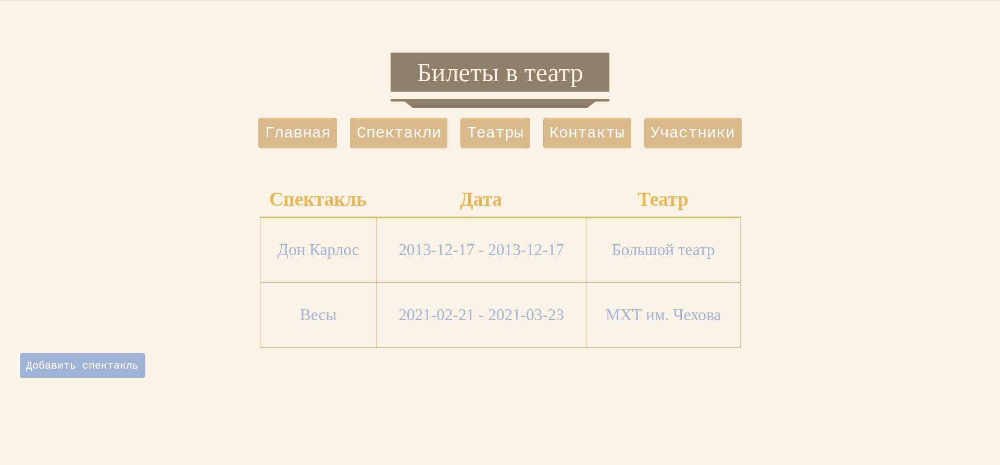 
## Страница всех театров
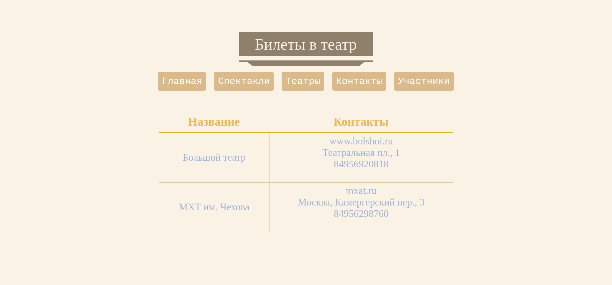 
## Страница со всеми театральными персоналиями
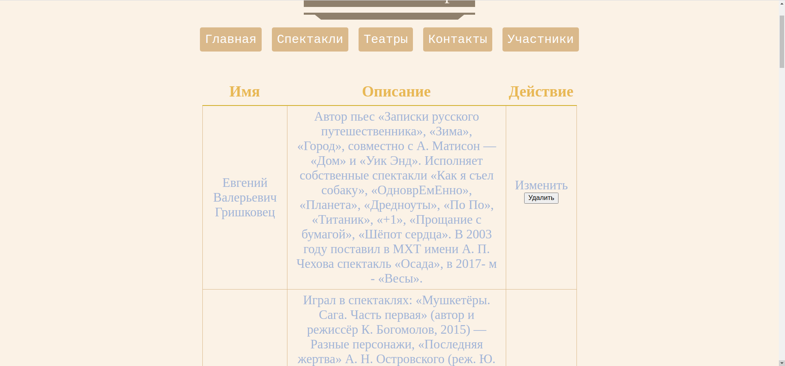 
## Страница по добавлению нового спектакля
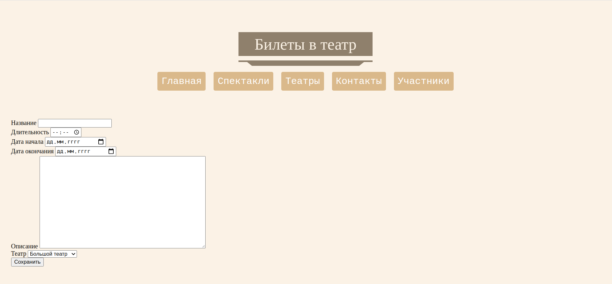
## Страница конкретного спектакля
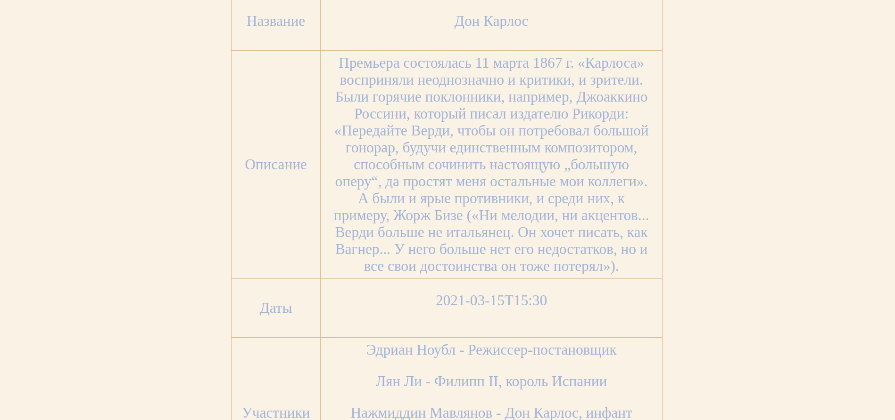
## Страница сеанса на спектакль
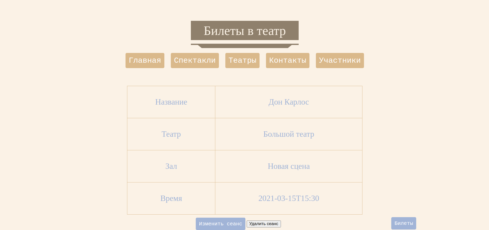
## Страница по покупке билетов
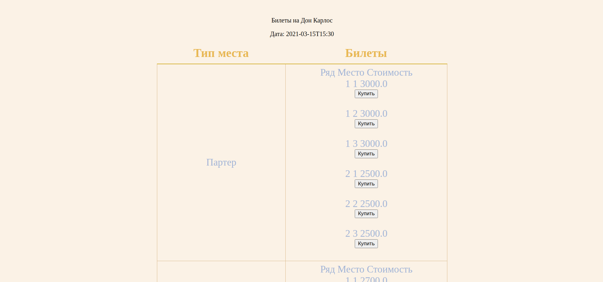
## Страница по добавлению нового сеанса
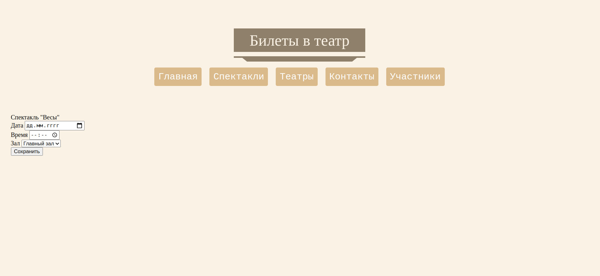
### Страница по формированию стоимости билетов для нового сеанса
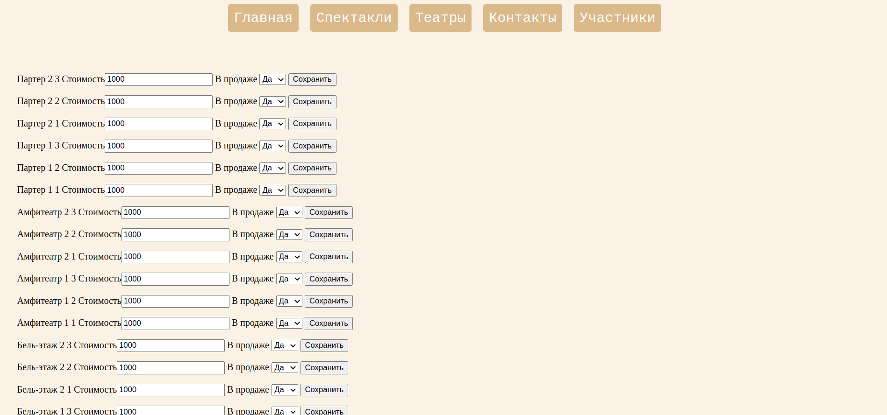 
## Страница по добавлению новой персоналии
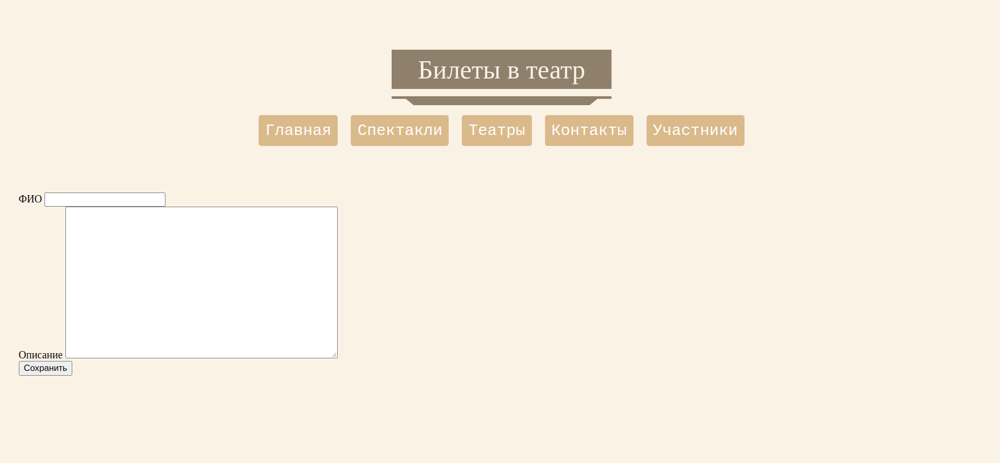
## Страница контактов
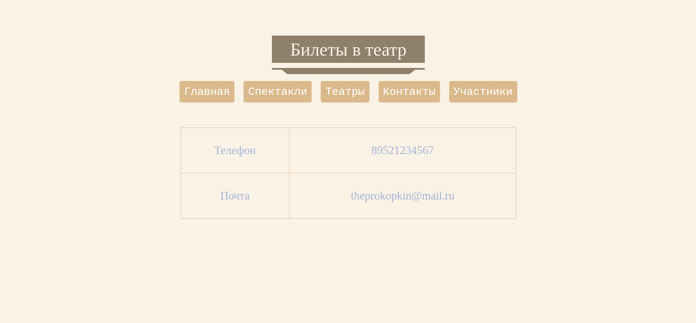
