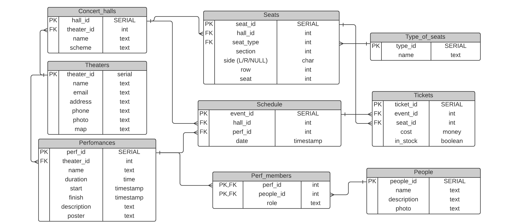

# Схема Базы данных

# Описание страниц
## Верхнее меню:
    • Театры -> Страница всех театров
    • Спектакли –> Страница всех спектаклей

## 1.Главная страница 
    • совпадает со страницей всех спектаклей

## 4. Страница театра
    • Фотография (-и)
    • Адрес, почта, телефон, скриншот карты
    • Описание театра (краткая история)
    • Список сотрудников (директор, заместители …)
    • Список залов
    • Спектакли (кликабельная ссылка) –> Страница спектаклей (выдаются только спектакли в данном театре)
    • Кнопка “Добавить спектакль” –> Страница для добавления спектакля

## 5. Страница со списком всех театров
    • Название театра (кликабельная ссылка) -> Страница театра
    • Адрес
    • Почта
    • Телефон
    • Скриншот карты
    • Кнопка “Добавить театр” -> Страница для добавления театра
    • Кнопка “Изменить/удалить театр” рядом с каждым театром -> Страница для изменения/удаления театра

## 6. Страница всех спектаклей (все спектакли, которые идут сейчас)
    • Название (кликабельная ссылка) –> Страница спектакля
    • Диапазон цены на билеты
    • Диапазон дат, когда он показан
    • Театр, в котором он идет
    • Афиша спектакля
    • Кнопка с возможностью выбора определенных театров 
    • Кнопка “удаление/изменение спектакля” рядом с каждым спектаклем -> Страница для удаления/изменения спектакля
    • Кнопка “добавление спектакля” –> Страница для добавления спектакля

## 7. Страница спектакля (конкретного)
    • Краткое описание
    • Список актеров, режиссер, сценарист и т.д.
    • Даты показа (кликабельные) -> Страница выбора билетов
    • Кнопка “изменить/удалить участника” рядом с каждым человеком из списка -> Страница по изменению/удалению участников
    • Кнопка “добавить участника” -> Страница по добавлению участника

## 8. Страница выбора билетов
    • Название спектакля
    • Дата
    • Название зала
    • Схема зала
    • Список свободных мест: слева тип места (партер, амфитеатр и т.д.), справа таблица (секция – ряд – место и цена) (кликабельно) ->  Страница покупки билета
    • Кнопка “добавить/удалить/изменить место” -> Страница по изменению билета
